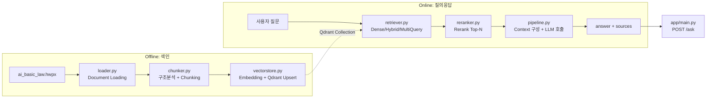

# Design — AI기본법 RAG QA 백엔드

관련 문서: [requirements.md](./requirements.md)

## 1. Overview

본 시스템은 두 개의 파이프라인으로 구성된다.

- **Offline Pipeline**: `data/ai_basic_law.hwpx` → 구조 분석 → Chunking → Embedding → Qdrant 저장 (1회 또는 문서 갱신 시 실행하는 배치 스크립트)
- **Online Pipeline**: 사용자 질문 → Retrieval(+검색 개선) → Reranking → Grounded Answer 생성 → `POST /ask` 응답 (FastAPI 상시 서비스)

기존 템플릿의 모듈 경계를 그대로 따른다: `rag/loader.py`, `rag/chunker.py`, `rag/vectorstore.py`, `rag/retriever.py`, `rag/reranker.py`, `rag/pipeline.py`, `app/main.py`, `eval/`. `common/`(config, qdrant, ai_model)은 이미 구현되어 있으므로 그대로 재사용한다.



---

## 1.1 설계 원칙 (전 모듈 공통)

**폴더 구조 유지(Req 10.7)**: 아래 구조를 그대로 유지하고, 새 디렉터리를 만들지 않는다. 모든 신규 코드는 기존 파일 안에 구현한다.

```text
rag_minipjt/
├── app/            # FastAPI 서비스 (main.py)
├── rag/            # loader / chunker / vectorstore / retriever / reranker / pipeline
├── common/         # config / qdrant / ai_model (공유 모듈, 변경 최소화)
├── eval/           # golden_set.jsonl / evaluate.py
├── data/           # 원본 법률 문서
└── docker-qdrant/  # Qdrant 로컬 기동
```

**가독성·유지보수성(Req 10.8)**: 기능 추가보다 우선한다.

| 원칙 | 적용 방식 |
|---|---|
| 단일 책임 | 모듈(파일) 하나는 하나의 역할만 가진다 — 예: `chunker.py`에서 Embedding을 호출하지 않는다 |
| 작은 함수 | 함수 하나는 하나의 작업 단위(로딩, 패턴 매칭, 분할, upsert 등)로 쪼갠다. 섹션 2의 함수 시그니처가 분해 기준이다 |
| 설정 외부화 | `top_k`, `max_chars`, 모델명 등 매직 넘버는 함수 인자 기본값 또는 `common/config.py`로 노출하고 본문에 하드코딩하지 않는다 |
| 명시적 이름 | 변수/함수/클래스명은 축약하지 않고 의도를 드러낸다(`qc`가 아닌 `qdrant_client`) |
| 타입 힌트 | 모든 공개 함수는 인자/반환 타입을 명시한다(섹션 2~3의 시그니처·데이터 모델을 그대로 따른다) |
| 계층 간 의존 방향 | `app` → `rag` → `common`, `eval` → `rag`/`common` 방향만 허용. 역방향 import 금지(예: `common`이 `rag`를 import하지 않음) |
| 주석 최소화 | 이름으로 의도가 드러나면 주석을 달지 않는다. 정규식 패턴처럼 "왜 이렇게 했는지"가 비자명한 경우에만 한 줄 주석을 남긴다 |

---

## 2. 모듈별 설계

### 2.1 `rag/loader.py` — Document Loading

**책임**: hwpx 원문을 파싱해 순수 텍스트(단락 리스트)로 변환.

**결정(Phase 0.2, 확정)**: Docling을 쓰지 않고 **Python 표준 라이브러리 `zipfile` + `xml.etree.ElementTree`로 직접 파싱**한다.

- 근거 1 — Docling 공식 지원 포맷(PDF, DOCX, PPTX, XLSX, HTML, 이미지, 오디오/비디오, LaTeX, USPTO/JATS/XBRL XML 등)에 HWP/HWPX가 없음을 확인했다(2026-10 기준 공식 문서 조사). RFP는 Docling을 "권장"했을 뿐 hwpx 지원을 보장하지 않으며, 미지원 포맷에 억지로 적용하면 실패하거나 별도 변환(hwp→pdf 등 손실 위험이 있는 변환)이 필요해진다.
- 근거 2 — `data/ai_basic_law.hwpx`를 `zipfile`로 열어 `Contents/section0.xml`(`<hp:p>`(문단) > `<hp:run>` > `<hp:t>`(텍스트) 구조)을 `xml.etree.ElementTree`로 파싱해본 결과, 511개 `<hp:t>` 노드에서 26,584자의 순수 텍스트가 깨짐 없이 추출되었고 장/조/항/호/목 기호(①②③, 1.2.3., 가.나.다.)가 모두 원문 그대로 보존됨을 실제로 확인했다 — 외부 의존성 없이 표준 라이브러리만으로 충분하다(Design §1.1 가독성·유지보수성 원칙과도 부합: 목적에 비해 과도한 의존성인 Docling — PDF OCR/레이아웃 모델 등 무거운 서브 의존성을 포함 — 을 피한다).
- 결과: `pyproject.toml`에 `docling`을 추가하지 않는다(§5 갱신).
- 이미지 캡션/표지 장식 텍스트(법제처 로고, QR 설명 등)는 본문 조항 패턴(`제\d+조`, `제\d+장`)이 시작되기 **이전** 블록으로 간주하여 제외한다.

```python
# rag/loader.py
def load_law_document(path: str) -> list[str]:
    """hwpx를 읽어 문단(paragraph) 단위 텍스트 리스트를 반환한다."""

def _extract_paragraphs_from_hwpx(path: str) -> list[str]: ...
def _strip_front_matter(paragraphs: list[str]) -> list[str]:
    """'제1장' 등장 이전의 표지/로고/캡션 블록 제거"""
```

출력 예시(개념): `["제1장 총칙", "제1조(목적)", " 이 법은 ...", "제2조(정의)", " 이 법에서 사용하는 ...", ...]`

### 2.2 `rag/chunker.py` — 구조 분석 + Chunking

**책임**: 문단 리스트에서 장/조/항/호/목 구조를 인식하고, 조 단위(필요 시 항 단위)로 Chunk를 생성.

**정규식 패턴**:
| 요소 | 패턴 | 예 |
|---|---|---|
| 장 | `^제(\d+)장\s*(.+)$` | 제1장 총칙 |
| 조 | `^제(\d+)조(?:의(\d+))?\(([^)]+)\)` | 제2조(정의) |
| 항 | `^\s*([①-⑮])` | ① ... |
| 호 | `^\s*(\d+)\.\s` | 1. ... |
| 목 | `^\s*([가-힣])\.\s` (단일 자모 + 마침표) | 가. ... |

**알고리즘 (State Machine)**:
1. 문단을 순회하며 "현재 장", "현재 조"를 추적하는 상태를 유지한다.
2. 조 제목 패턴을 만나면 새 Chunk를 open, 다음 조 제목(또는 장 제목, 문서 끝)을 만날 때까지 본문을 누적한다.
3. Chunk 누적 중 길이가 임계치(기본 1,500자, 설정 가능)를 넘으면 하위 분할한다(제2조처럼 호·목이 많은 조문 대응). **분할 기준은 해당 조문에 항(①②③) 기호가 있는지에 따라 달라진다**:
   - 항이 있으면 항 경계에서 분할 → `clause_no="①"` 등으로 표시 (예: 제22조의2)
   - 항이 없고 호(1. 2. 3. …)만 있으면 호 경계에서 분할 → `clause_no="1호"` 등으로 표시 (예: 제2조(정의)는 항 없이 조 → 호로 바로 이어지는 구조이므로 항 기준 분할이 불가능하다)
4. 부칙 블록은 `article_no="부칙"`으로 별도 처리한다.

**실측 데이터(확정 근거)**: 전체 46개 조문(제1조~제43조 + 제17조의2/제22조의2/제22조의3) 길이를 실측한 결과 평균 574자, 1,500자를 넘는 조문은 **제2조(정의, 2,007자 — 항 없이 호 1~12까지 직접 나열)와 제22조의2(인공지능연구소의 설립 및 지원 등, 1,692자 — 항 ①~⑫ 보유)** 단 2개뿐이다. 따라서 임계치 1,500자는 적절하며, 두 예외 조문에 대해서만 각각 호 단위/항 단위 분할이 실제로 발동한다. 나머지 44개 조문은 조 단위 그대로 하나의 Chunk가 된다.

```python
# rag/chunker.py
@dataclass
class LawChunk:
    id: str                    # 결정론적 ID (예: uuid5(NAMESPACE, "art-2" 혹은 "art-2-clause-1"))
    text: str                  # Chunk 원문 (조 제목 포함)
    chapter_no: int | None
    chapter_title: str | None
    article_no: int | str      # 부칙은 "부칙"
    article_title: str | None
    clause_no: str | None      # "①" 또는 "1호" 등, 분할된 경우만 (§2.2 분할 기준 참고)
    law_name: str = "인공지능기본법"
    law_number: str = "법률 제21311호"
    enforcement_date: str = "2026-07-21"

def chunk_law_document(paragraphs: list[str], max_chars: int = 1500) -> list[LawChunk]: ...
```

### 2.3 `rag/vectorstore.py` — Embedding + Qdrant 저장

**책임**: `LawChunk` → 벡터 → Qdrant Point 적재.

- Collection 이름: `ai_basic_law` (설정 가능, `common/config.py`에 `QDRANT_COLLECTION` 추가 권장).
- Vector size: `common.ai_model.get_embedding_model()`의 모델(`text-embedding-3-small` 기본, 1536차원)에서 1회 probe하여 결정하거나 상수로 고정.
- Point ID: `uuid.uuid5(NAMESPACE_DNS, chunk.id)` — 재색인 시 upsert로 덮어써 중복 방지.
- Payload: `LawChunk`의 모든 필드 + `text`.
- Hybrid Search(§2.4 Phase 0.3 결정에 따라 채택 확정)를 위해 **BM25는 `rank_bm25` 별도 인메모리 인덱스**로 구축한다(Qdrant Named Vectors/sparse vector 재구성은 사용하지 않음 — 구현 단순화).

```python
# rag/vectorstore.py
def build_vectorstore(chunks: list[LawChunk]) -> None:
    """Embedding 생성 후 Qdrant에 upsert. Collection 없으면 생성."""

def ensure_collection(client, name: str, vector_size: int) -> None: ...
```

### 2.4 `rag/retriever.py` — Retrieval + 검색 개선

**책임**: 질문 → 후보 Chunk 목록(Top-K).

**Baseline — Dense Retrieval**:
```python
def retrieve_dense(query: str, top_k: int = 10) -> list[RetrievedChunk]: ...
```

**Advanced RAG (requirements.md §5, 최소 1개 이상 구현)**:

**결정(Phase 0.3, 확정)**: 1순위로 **Hybrid Search(Dense+BM25) + RRF**를 구현한다. Metadata Filtering은 2순위(여유가 있으면 추가하는 보완 기법), Multi Query는 3순위로 둔다.

- 근거 — 법률 QA는 "고영향 인공지능", "인공지능사업자", "검ㆍ인증등"처럼 **정의된 용어/조문 번호의 정확한 매칭**이 중요한 도메인이다. Dense 임베딩만으로는 의미는 비슷하지만 정확한 법률 용어가 다른 문장을 상위에 올릴 위험이 있는 반면, BM25는 질문에 등장한 법률 용어·조문 번호 자체의 어휘적 일치를 직접 반영해 Dense를 보완한다 — 이 도메인에서 가장 비용 대비 효과가 큰 조합이다.
- 근거 — 구현 비용도 가장 낮다: `rank_bm25`는 순수 Python, 추가 인프라(Qdrant sparse vector 재구성 등) 없이 전체 Chunk 텍스트로 인메모리 인덱스를 만들면 된다. RRF는 외부 의존성 없는 간단한 점수 융합 공식이다.
- Multi Query는 질문이 이미 법조문 용어를 그대로 사용하는 경우가 많아(예: "고영향 인공지능이란?") 질의 재작성의 이득이 상대적으로 작고, 질문마다 LLM 호출이 추가로 1회 더 들어가 비용·지연이 늘어난다. 1차 구현 범위에서는 제외하고, Phase 5에서 Hybrid만으로 개선이 부족한 질문 유형이 확인되면 추가한다.
- Metadata Filtering(정규식으로 질문에서 `제N조` 추출 → Qdrant Filter)은 구현이 간단하고 Hybrid와 독립적으로 얹을 수 있어 여유가 되면 함께 구현한다.

| 기법 | 우선순위 | 구현 방식 |
|---|---|---|
| Hybrid Search (Dense+BM25) | 1순위(채택) | `retrieve_dense` 결과와 `rank_bm25`(코퍼스: 전체 Chunk 텍스트, 형태소 분리는 공백/간이 토크나이저로 시작) 결과를 각각 순위 리스트로 얻음 |
| RRF | 1순위(채택, Hybrid 융합에 필수) | `score(d) = Σ 1 / (k + rank_i(d))`, k=60 기본값 |
| Metadata Filtering | 2순위(여유 시) | 질문에서 `제N조`, `제N장` 패턴을 정규식으로 추출되면 Qdrant `Filter(must=[FieldCondition(key="article_no", match=MatchValue(value=N))])` 적용 |
| Multi Query | 3순위(보류) | LLM에 "아래 질문을 의미는 유지하되 표현이 다른 질의 3개로 바꿔줘" 프롬프트 → 각 질의로 `retrieve_dense` 호출 → `chunk.id` 기준 합집합(dedup), 점수는 max 또는 평균 |

```python
def retrieve(
    query: str,
    top_k: int = 10,
    use_multi_query: bool = False,
    use_hybrid: bool = False,
) -> list[RetrievedChunk]:
    """baseline과 advanced 기법을 플래그로 토글 — eval에서 Before/After 비교용"""
```

### 2.5 `rag/reranker.py` — Reranking

**책임**: 1차 후보(Top-K, 예 K=10) → 최종 Top-N(예 N=4) 재정렬.

- 옵션 A(권장, 외부 의존성 최소화): LLM 기반 listwise/pointwise relevance scoring — `common.ai_model.get_llm_model()`에 "질문과 각 조문 후보의 관련도를 0~10으로 채점" 프롬프트.
- 옵션 B: Cross-Encoder(예 `BAAI/bge-reranker` 계열, `sentence-transformers` 추가 의존성 필요) — 로컬 추론 비용 고려해 선택적.
- 실패 시 1차 검색 순서를 그대로 반환(fallback, requirements §6.4).

```python
def rerank(query: str, candidates: list[RetrievedChunk], top_n: int = 4) -> list[RetrievedChunk]: ...
```

### 2.6 `rag/pipeline.py` — Grounded Answer

**책임**: Retrieval → Rerank → Context 구성 → LLM → 답변 조립. Online 파이프라인의 단일 진입점.

> **의존 방향 주의(Design §1.1)**: `rag/`는 `app/`을 import하지 않는다. 따라서 `rag/pipeline.py`는 FastAPI/Pydantic에 의존하지 않는 순수 `dataclass`로 결과를 반환하고, `app/main.py`가 이를 Pydantic 응답 모델로 변환한다. `eval/evaluate.py`도 `app`이 아닌 `rag.pipeline`을 직접 import해 사용한다.

```python
@dataclass
class AnswerSource:
    article: str   # 예: "제2조"
    content: str

@dataclass
class AnswerResult:
    answer: str
    sources: list[AnswerSource]

def answer_question(question: str) -> AnswerResult:
    candidates = retrieve(question, top_k=10, use_hybrid=True)
    top = rerank(question, candidates, top_n=4)
    if not top:
        return AnswerResult(answer="관련 법률 근거를 찾지 못했습니다.", sources=[])
    context = _build_context(top)          # "제N조(제목)\n{text}" 를 조문별로 join
    answer_text = _generate_answer(question, context)  # LLM 호출, Grounded 프롬프트
    return AnswerResult(answer=answer_text, sources=_to_sources(top))
```

**프롬프트 설계 원칙**(requirements §7.1):
- System: "너는 인공지능기본법 QA 어시스턴트다. 반드시 주어진 <context>의 조문만 근거로 답하라. context에 없는 내용은 모른다고 답하라."
- User: `질문: {question}\n\n<context>\n{context}\n</context>`
- Context 없음 → LLM 호출 자체를 생략하고 고정 응답("근거를 찾을 수 없습니다") 반환 — 비용 절감 + Hallucination 방지.

### 2.7 `app/main.py` — API

```python
class AskRequest(BaseModel):
    question: str

class Source(BaseModel):
    article: str
    content: str

class AskResponse(BaseModel):
    answer: str
    sources: list[Source]

@app.post("/ask", response_model=AskResponse)
def ask(req: AskRequest) -> AskResponse:
    if not req.question.strip():
        raise HTTPException(status_code=400, detail="question is required")
    try:
        result = pipeline.answer_question(req.question)  # AnswerResult (rag/pipeline.py)
    except Exception as e:
        raise HTTPException(status_code=500, detail="internal error") from e
    return AskResponse(
        answer=result.answer,
        sources=[Source(article=s.article, content=s.content) for s in result.sources],
    )
```

- `GET /health` : Qdrant 연결 상태 등 간단한 liveness 체크(requirements §8.6, SHOULD).

### 2.8 `eval/` — Evaluation

> **구현 완료(tasks.md Phase 9.1/9.2/9.4)**: 아래는 실제로 작성된 `eval/golden_set.jsonl`(25문항)과 `eval/evaluate.py`를 그대로 기술한 것이다. Phase 1~8이 구현되기 전까지는 `retriever.retrieve()` / `pipeline.answer_question()` 호출 지점에서 `AttributeError`가 나지만, `eval/evaluate.py`는 `rag.retriever`/`rag.pipeline` **모듈**을 import하므로(심볼 직접 import 아님) 그 자체의 import는 깨지지 않는다.

**`eval/golden_set.jsonl`** 레코드 포맷(25개 레코드, 6개 장 전체 포괄):
```json
{"id": "q03", "chapter": "제1장 총칙", "question": "고영향 인공지능이란 무엇인가요?", "expected_articles": ["제2조"], "expected_answer_keywords": ["생명", "신체의 안전", "기본권"]}
```

**`eval/evaluate.py`** 구성:
```python
@dataclass
class GoldenItem:
    id: str
    question: str
    expected_articles: list[str]
    expected_answer_keywords: list[str]

def load_golden_set(path: Path = GOLDEN_SET_PATH) -> list[GoldenItem]: ...

def _normalize_article(value: str | int) -> str:
    """'제2조' / 2 / '17의2' 등 서로 다른 조문 표기를 비교 가능한 키로 변환"""

def evaluate_retrieval(
    golden_set: list[GoldenItem],
    retrieve_fn: Callable[[str, int], list],  # (question, top_k) -> list[RetrievedChunk]
    k: int = DEFAULT_TOP_K,
) -> dict:
    """Hit@K, Recall@K, MRR 반환"""

def evaluate_answers(
    golden_set: list[GoldenItem],
    answer_fn: Callable[[str], object],  # question -> AnswerResult
) -> dict:
    """answer_keyword_coverage(답변 키워드 포함률), source_grounded_rate(근거 조문 일치율) 반환"""

def compare_retrieval_configs(golden_set: list[GoldenItem], k: int = DEFAULT_TOP_K) -> dict:
    """baseline(dense only) vs advanced(multi-query + hybrid 동시 적용) 비교.
    주의: '최종 채택'은 Hybrid 1순위(§2.4)이지만, 이 비교 프리셋은 Multi
    Query까지 함께 켠 "최대 구성"을 advanced로 두어 상한선을 같이 본다."""

def main() -> None:
    """CLI: `uv run python -m eval.evaluate [--top-k N] [--skip-answers]`
    Retrieval 비교 표 출력 → (옵션) Answer 평가 출력"""
```

`load_golden_set`/`evaluate_retrieval`/`evaluate_answers`는 가짜(mock) retrieve/answer 함수로 단위 검증 완료(완전한 hit 시 hit_at_k=recall_at_k=mrr=1.0 확인).

---

## 3. 데이터 모델 요약

| 모델 | 필드 | 위치 |
|---|---|---|
| `LawChunk` | id, text, chapter_no, chapter_title, article_no, article_title, clause_no, law_name, law_number, enforcement_date | `rag/chunker.py` |
| `RetrievedChunk` | chunk: LawChunk, score: float | `rag/retriever.py` |
| `AnswerSource` | article: str, content: str | `rag/pipeline.py` |
| `AnswerResult` | answer: str, sources: list[AnswerSource] | `rag/pipeline.py` |
| `AskRequest` | question: str | `app/main.py` (Pydantic, `AnswerResult`을 HTTP 응답으로 변환) |
| `Source` | article: str, content: str | `app/main.py` (Pydantic, `AnswerSource`에 대응) |
| `AskResponse` | answer: str, sources: list[Source] | `app/main.py` (Pydantic, `AnswerResult`에 대응) |
| `GoldenItem` | id, question, expected_articles, expected_answer_keywords (원본 jsonl에는 `chapter` 필드도 있으나 평가 로직에선 미사용) | `eval/evaluate.py` (파싱 대상: `eval/golden_set.jsonl`) |

---

## 4. 설정 (`common/config.py` 확장)

기존 변수(API_KEY, BASE_URL, MODEL, EMBEDDING_MODEL, QDRANT_URL)에 추가:

```python
QDRANT_COLLECTION = os.getenv("QDRANT_COLLECTION", "ai_basic_law")
RETRIEVAL_TOP_K = int(os.getenv("RETRIEVAL_TOP_K", 10))
RERANK_TOP_N = int(os.getenv("RERANK_TOP_N", 4))
CHUNK_MAX_CHARS = int(os.getenv("CHUNK_MAX_CHARS", 1500))
```

## 5. 추가 의존성 (`pyproject.toml`)

현재 설치된 패키지(`fastapi`, `langchain-openai`, `langchain-qdrant`, `qdrant-client`, `python-dotenv`, `uvicorn`)에 더해:

- `rank-bm25` (Hybrid Search 1순위 채택, §2.4 — 추가 필요)
- ~~`docling`~~ — **추가하지 않음**(§2.1 결정: hwpx는 Docling 미지원 포맷이라 표준 라이브러리 `zipfile`+`xml.etree.ElementTree`로 직접 파싱)
- (선택) `sentence-transformers` — Cross-Encoder Reranker 채택 시에만

## 6. 에러 처리 요약

| 계층 | 실패 시나리오 | 처리 |
|---|---|---|
| loader | hwpx 파싱 실패 | 예외 발생, 배치 중단 |
| vectorstore | Qdrant 연결 실패 | 예외 발생, 명확한 메시지 |
| retriever | Qdrant 검색 실패 | 예외를 상위로 전파(조용한 빈 결과 금지) |
| reranker | LLM/모델 호출 실패 | 1차 검색 순서로 fallback |
| pipeline | Context 없음 | "근거 없음" 고정 응답, LLM 미호출 |
| API | question 누락/빈 값 | 400 |
| API | 내부 예외 | 500, 시크릿 미노출 |

## 7. 평가 전략(Testing Strategy)

- **단위**: `chunker.py`의 정규식 파싱 결과를 샘플 조문(예: 제2조, 제3조)으로 수작업 검증.
- **통합**: `eval/evaluate.py`로 Retrieval 지표(Hit@K/Recall@K/MRR)를 baseline vs advanced 비교.
- **End-to-End**: `POST /ask`에 실제 질문(예: "고영향 인공지능이란 무엇인가요?")을 보내 RFP 예시 응답 형태와 일치하는지 확인.
